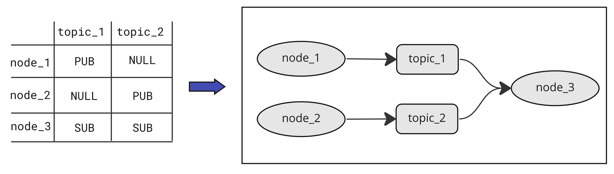

# graph-maker-ros2
Graph maker for ros2 elements (Nodes and Topics). This project is very simple, it's a library that transforms indices matrix to graphic visualization.
This library produces a rqt-like graph, so _why use it_? It has been very useful for me when rqt is not available in raspberry environments without gui (like ubuntu-core).

You can use a node to pull out the graph produced by the maker and view it on the Web, through a socket, with `rosboard`.


## Directories Layout
```
├── GraphMaker.py
├── requirements.txt
├── node_example.py
├── README.md
├── repo_resources
│   └── rqt_graph.jpg
├── src
│   ├── draw_elements.py
│   ├── Drawer.py
│   ├── ENodeType.py
│   └── utils.py
└── test
    ├── test_drawer.py
    ├── test_maker.py
    └── test_utils.py
```

## Requirements
```
git clone https://github.com/AngeloDamante/graph-maker-ros2.git
cd graph-maker-ros2
pip3 install -r requirements.txt
```

## Use in ROS2
In the `src` file of ros2 workspace. Create a pkg named _graph_maker_ with this library.
```
git clone https://github.com/AngeloDamante/graph-maker-ros2.git
chmod +x graph-maker-ros2/create_pkg.sh
./graph-maker-ros2/create_pkg.sh
```

## Usage
Generally a custom node creates the incidence matrix by looking at the active nodes and topics with rclcpy. You can find an example of this node in `node_example.py`.

### Input: Indices Matrix
```
nodes = ['/node1', '/node2']
topics = ['/topic1', '/topic2', 'topic3']
incidence_matrix = [[NodeType.PUB, NodeType.NULL, NodeType.SUB],
                    [NodeType.NULL, NodeType.PUB, NodeType.SUB],
                    [NodeType.PUB, NodeType.PUB, NodeType.PUB]]
```
### Output: Image with ros Graph
```
o_gm = GraphMaker(nodes, topics, incidence_matrix)
if o_gm.make_graph():
    cv2.imwrite("graph.png", o_gm.get_graph())
```

## Future developments
- improve graph generator
- add namespace handler